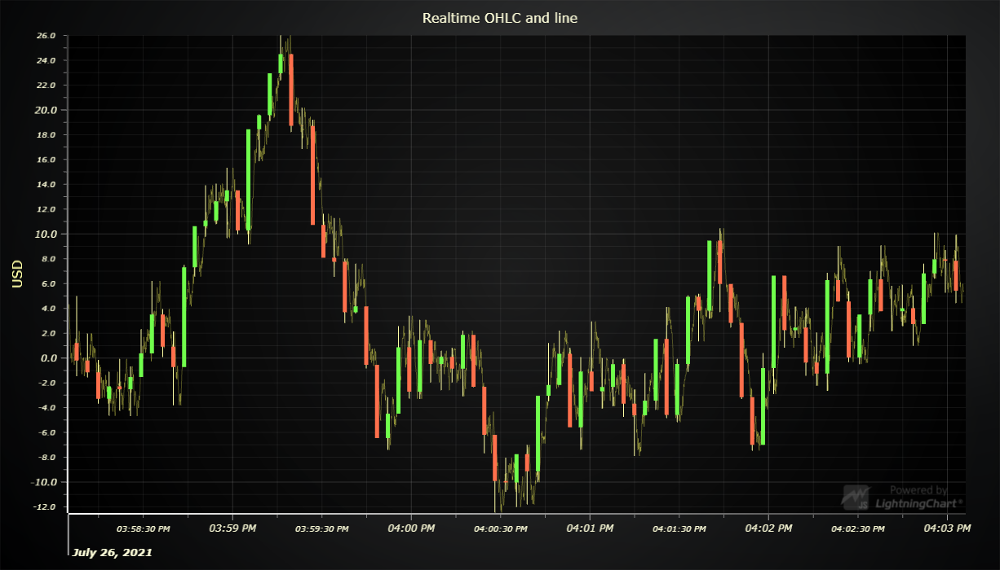
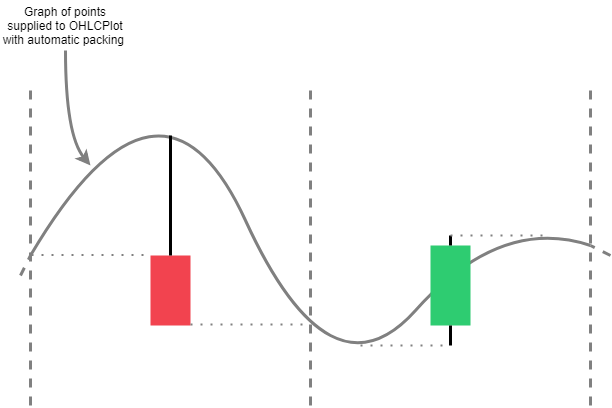

# JavaScript OHLC Chart with Automatic Packing



This demo application belongs to the set of examples for LightningChart JS, data visualization library for JavaScript.

LightningChart JS is entirely GPU accelerated and performance optimized charting library for presenting massive amounts of data. It offers an easy way of creating sophisticated and interactive charts and adding them to your website or web application.

The demo can be used as an example or a seed project. Local execution requires the following steps:

- Make sure that relevant version of [Node.js](https://nodejs.org/en/download/) is installed
- Open the project folder in a terminal:

        npm install              # fetches dependencies
        npm start                # builds an application and starts the development server

- The application is available at *http://localhost:8080* in your browser, webpack-dev-server provides hot reload functionality.


## Description

This example shows real-time OHLC-packing using a variant of OHLC-series.

```javascript
const chart = lightningChart().ChartXY()
const series = chart.addOHLCSeries(
    // Specify the type of OHLC-series for adding points
    { seriesConstructor: OHLCSeriesTypes.AutomaticPacking }
)
```

OHLC-series that were created with type 'AutomaticPacking' accept data the same way as any other horizontally progressive XY-series:

```javascript
// Single point.
series.add({ x: 50, y: 60 })

// Multiple points at once.
series.add([
    { x: 55, y: 60 },
    { x: 60, y: 62},
    { x: 65, y: 65}
])
```

## Packing logic

Supplied points are packed by columns, within which the Y-values are mapped to open, high, low and close -values, which are used to draw *OHLCFigures*.

[//]: # "IMPORTANT: The assets will not show before README.md is built - relative path is different!"




## API Links

* [XY cartesian chart]
* [Axis tick strategies]
* [Freeform line series]
* [OHLC series]
* [OHLC series types]


## Support

If you notice an error in the example code, please open an issue on [GitHub][0] repository of the entire example.

Official [API documentation][1] can be found on [Arction][2] website.

If the docs and other materials do not solve your problem as well as implementation help is needed, ask on [StackOverflow][3] (tagged lightningchart).

If you think you found a bug in the LightningChart JavaScript library, please contact support@arction.com.

Direct developer email support can be purchased through a [Support Plan][4] or by contacting sales@arction.com.

[0]: https://github.com/Arction/
[1]: https://www.arction.com/lightningchart-js-api-documentation/
[2]: https://www.arction.com
[3]: https://stackoverflow.com/questions/tagged/lightningchart
[4]: https://www.arction.com/support-services/

© Arction Ltd 2009-2020. All rights reserved.


[XY cartesian chart]: https://www.arction.com/lightningchart-js-api-documentation/v3.3.0/classes/chartxy.html
[Axis tick strategies]: https://www.arction.com/lightningchart-js-api-documentation/v3.3.0/globals.html#axistickstrategies
[Freeform line series]: https://www.arction.com/lightningchart-js-api-documentation/v3.3.0/classes/lineseries.html
[OHLC series]: https://www.arction.com/lightningchart-js-api-documentation/v3.3.0/classes/chartxy.html#addohlcseries
[OHLC series types]: https://www.arction.com/lightningchart-js-api-documentation/v3.3.0/globals.html#ohlcseriestypes

